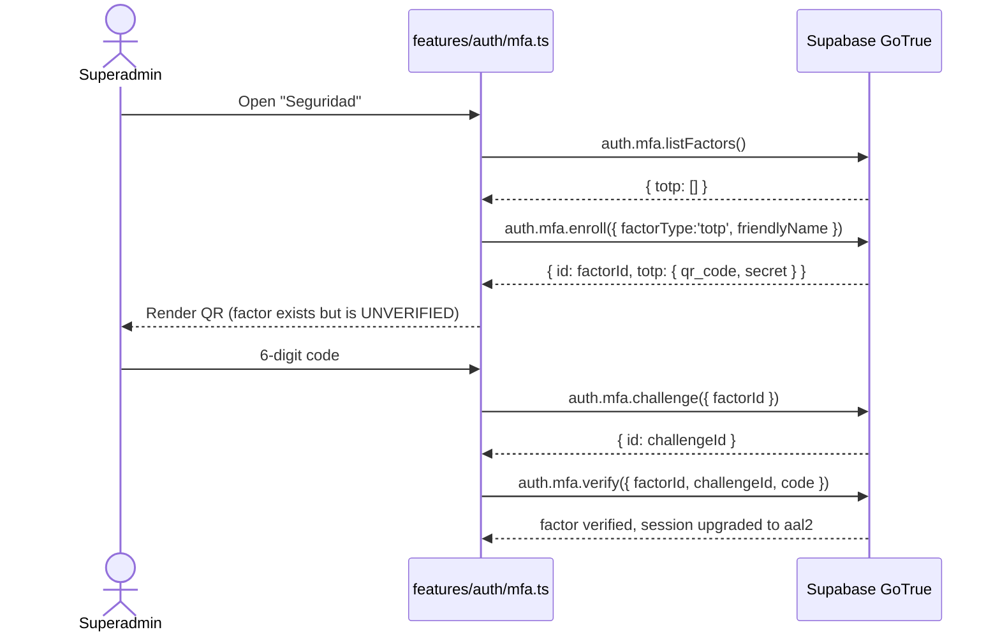
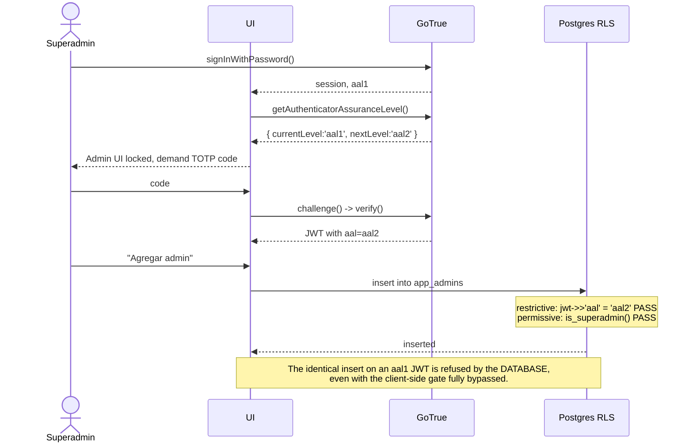

# Design: ARCA Platform Evolution

## Technical Approach

Decompose the 858-line `index.html` into a Vite + TypeScript multi-entry build with one pure, unit-tested `money` module; move every authorization decision into Postgres (RLS + `SECURITY DEFINER` helpers + a `restrictive` AAL2 policy); expose the only public surface through one zero-config Vercel Function holding `service_role` server-side. The browser is treated as untrusted throughout: client-side role and AAL checks exist for UX only, and every one of them has a database-side counterpart that is the actual boundary.

---

## Architecture Decisions

### D1 — Public view: second Vite entry, not a standalone static page

| Option | Tradeoff | Decision |
|---|---|---|
| Second HTML entry in the same Vite build | +6 lines of `rollupOptions.input`; shares `lib/escape.ts` and the response type | **Chosen** |
| Separate hand-written static page | Duplicates escaping logic — the exact drift that would ship unescaped output to anonymous visitors | Rejected |
| Route inside the admin SPA | Would load `supabase.ts` + anon key into a page that must have neither | Rejected |

**Rationale**: the proposal deliberately lands escaping in Phase 1 so Phase 3 cannot ship unescaped public output. That guarantee only holds if both entries import the *same* `escapeHtml`. `public-view.ts` never imports `lib/supabase.ts`, so tree-shaking keeps supabase-js and the anon key out of the public bundle.

### D2 — No `vercel.json`

**Supersedes proposal.md's Affected Areas table**, which listed `vercel.json` as New for an SPA rewrite — that assumed a path-based router. Reading the actual code shows otherwise:

The app navigates by **hash** (`#dashboard`, `#miembros` — `index.html:90-93`), so deep links never reach the server. Both entries (`/` and `/vista/`) are real files in `dist/`. An SPA catch-all rewrite would therefore add zero value and one way to mis-route `/api/*`. Research C10 established a rewrite is needed *for path-based routers*; this app has none. `api/*.ts` needs no config at all (C9).

**Reintroduce it only if** routing moves from hash to History API. Apply-time check: confirm `/vista/` and `/api/debt-view` both resolve on a preview deployment, since Vercel's Vite preset may inject its own SPA fallback.

### D3 — `SECURITY DEFINER` helpers, not inline subqueries, for role checks

A policy on `app_admins` that queries `app_admins` recurses infinitely. `SECURITY DEFINER` bypasses RLS inside the function body and breaks the cycle; it also gives one place to change the role model later. `set search_path = ''` is mandatory to prevent search-path hijacking of a definer function.

### D4 — `REVOKE` from `anon` as the anon-denial mechanism

RLS-with-no-`anon`-policy already denies, but that is denial *by omission* — one future permissive policy written `to public` silently re-opens it. That is precisely the failure mode behind the live incident. `revoke all ... from anon` sits at the GRANT layer, **below** RLS, and survives a policy mistake. Both layers are applied; the REVOKE is the one being relied upon.

### D5 — Last-superadmin guard: statement-level trigger, not RLS, not CHECK

| Mechanism | Verdict |
|---|---|
| `CHECK` constraint | Impossible — cannot see other rows |
| RLS `USING` subquery | **Unsound**: `USING` evaluates the OLD row per-row, so `update app_admins set rol='admin'` demoting two superadmins passes both row checks and leaves zero. Also surfaces as an opaque RLS error |
| `AFTER ... FOR EACH STATEMENT` trigger | **Chosen** — sees the final post-statement state once, and raises a named code the UI maps to a real message |

### D6 — Integer cents, no decimal library

All amounts are MXN at club scale; the largest plausible total is ~7 orders of magnitude below `Number.MAX_SAFE_INTEGER` in cents. `decimal.js` (~30 KB) to serve two functions is overkill and contradicts the project's YAGNI direction. Conversion happens **only** at the repository boundary (`features/*/repo.ts`); `money.ts` never touches the DB and feature UI code never does raw arithmetic.

### D7 — `api/debt-view.ts` takes no parameters

A `?miembro=` parameter would turn the endpoint into an enumeration oracle and add a validation surface for no gain — the public view is the whole club's ranking by design. No params means nothing to validate and nothing to inject.

### D8 — Phase 0 closes signup only; roles arrive in Phase 2

The live vector is *self-registration into blanket `authenticated` access*. Flipping `disable_signup` plus revoking `anon` removes it immediately, keeps existing real admins working, and is reversible by replaying two statements. Introducing `app_admins` in Phase 0 would couple the emergency fix to a lockout risk.

> **Gap found in the proposal**: disabling signup does **not** remove accounts that already self-registered. Phase 0 MUST include an audit of `auth.users` against the known operator list, deleting or banning unrecognized accounts. Without it, Phase 0 does not close the incident.

---

## Module Boundaries

```
index.html                     Vite entry (admin SPA shell)
vista/index.html               Vite entry #2 (public, unauthenticated)
api/debt-view.ts               Vercel Function — service_role, server-only
src/
  app.ts                       shell: owns shared member state, passes refresh() down
  main.ts                      admin entry
  public-view.ts               public entry — imports lib/escape + types ONLY
  lib/
    supabase.ts                createClient(VITE_SUPABASE_URL, VITE_SUPABASE_ANON_KEY)
    money.ts                   PURE — zero imports, 100% unit-tested
    escape.ts                  escapeHtml(), setText()
    types.ts                   DB row types + DebtViewResponse (shared with api/)
  features/
    auth/       index.ts  session.ts  mfa.ts
    dashboard/  index.ts  charts.ts
    miembros/   index.ts  repo.ts
    apoyos/     index.ts  repo.ts
    pagos/      index.ts  repo.ts
    admin/      index.ts  bank-config.ts      (superadmin-only)
```

**Dependency rule**: `features/*` may import `lib/*`, never each other. Today `handleAddMember` calls `initializeApoyosModule()` and `initializePagosModule()` directly (`index.html:581-583`); that cross-talk becomes `app.ts` handing each feature a `refresh()` callback. No event bus — one callback is enough.

`vite.config.ts` essentials:

```ts
export default defineConfig({
  plugins: [tailwindcss()],          // exact plugin pinned at install time
  build: { rollupOptions: { input: {
    main:  resolve(__dirname, 'index.html'),
    vista: resolve(__dirname, 'vista/index.html'),
  }}},
});
```

---

## Database Design

### New tables

```sql
create table public.app_admins (
  user_id    uuid primary key references auth.users(id) on delete cascade,
  email      text not null,
  rol        text not null check (rol in ('superadmin','admin')),
  created_at timestamptz not null default now(),
  created_by uuid references auth.users(id) on delete set null
);

create table public.configuracion_bancaria (
  id         smallint primary key default 1 check (id = 1),  -- singleton
  banco      text not null,
  clabe      text not null check (clabe ~ '^[0-9]{18}$'),
  titular    text not null,
  updated_by uuid references auth.users(id) on delete set null,
  updated_at timestamptz not null default now()
);
```

`user_id` as PK (not a surrogate `id`) makes "one role per user" structural. The `check (id = 1)` singleton removes any "which config is active" logic from the public function.

### Role helpers

```sql
create or replace function public.is_admin() returns boolean
language sql stable security definer set search_path = '' as $$
  select exists (select 1 from public.app_admins where user_id = (select auth.uid()));
$$;

create or replace function public.is_superadmin() returns boolean
language sql stable security definer set search_path = '' as $$
  select exists (select 1 from public.app_admins
                 where user_id = (select auth.uid()) and rol = 'superadmin');
$$;

revoke execute on function public.is_admin(), public.is_superadmin() from public, anon;
grant  execute on function public.is_admin(), public.is_superadmin() to authenticated;
```

### RLS for all 6 tables

```sql
-- Applied to each of: miembros, cargos, registro_apoyos, registro_pagos,
--                     app_admins, configuracion_bancaria
alter table public.<t> enable row level security;
revoke all on public.<t> from anon;        -- D4: the load-bearing anon denial
```

| Table | SELECT | INSERT / UPDATE / DELETE |
|---|---|---|
| `miembros`, `cargos`, `registro_apoyos`, `registro_pagos` | `is_admin()` | `is_admin()` |
| `configuracion_bancaria` | `is_admin()` | `is_admin()` |
| `app_admins` | `is_admin()` (an admin must read its own role at aal1) | `is_superadmin()` **+ restrictive AAL2** |

The four existing blanket `ALL to authenticated` policies are dropped first.

### The AAL2 boundary (research C1)

Scoped to **writes only** — a blanket `as restrictive` with no `for` clause defaults to `FOR ALL` and would block the aal1 SELECT the app needs to discover its own role, locking every session out of its own UI.

```sql
create policy "app_admins_insert_aal2" on public.app_admins
  as restrictive for insert to authenticated
  with check ((select auth.jwt()->>'aal') = 'aal2');

create policy "app_admins_update_aal2" on public.app_admins
  as restrictive for update to authenticated
  using      ((select auth.jwt()->>'aal') = 'aal2')
  with check ((select auth.jwt()->>'aal') = 'aal2');

create policy "app_admins_delete_aal2" on public.app_admins
  as restrictive for delete to authenticated
  using      ((select auth.jwt()->>'aal') = 'aal2');
```

Variant chosen from C2: *all authenticated users*. Safe because only superadmins pass the permissive `is_superadmin()` policy anyway, so the non-MFA `admin` role never touches this table.

### Last-superadmin guard (D5)

```sql
create or replace function public.guard_ultimo_superadmin() returns trigger
language plpgsql as $$
begin
  if (select count(*) from public.app_admins where rol = 'superadmin') = 0 then
    raise exception 'ultimo_superadmin_protegido' using errcode = 'P0001';
  end if;
  return null;
end;
$$;

create trigger trg_guard_ultimo_superadmin
  after update or delete on public.app_admins
  for each statement execute function public.guard_ultimo_superadmin();
```

Raises a **stable machine code**, not prose, so the DB stays language-neutral and `features/admin/` maps it to the Spanish UI message.

### Member lifecycle DDL

```sql
alter table public.miembros add column activo boolean not null default true;

-- Read the REAL constraint names from information_schema first; do not assume defaults.
alter table public.cargos        drop constraint <fk_name>,
  add constraint cargos_miembro_id_fkey
  foreign key (miembro_id) references public.miembros(id) on delete restrict;
alter table public.registro_pagos drop constraint <fk_name>,
  add constraint registro_pagos_miembro_id_fkey
  foreign key (miembro_id) references public.miembros(id) on delete restrict;
```

`cargos.apoyo_id → registro_apoyos` keeps `CASCADE` — out of scope, noted only.

**UI**: *Retirar* is the primary action (`update miembros set activo=false`) — reversible, preserves history, and removes the member from apoyo candidate sets, the pago selector, and the public view. *Eliminar* sits behind a confirm dialog and only succeeds for a member with no financial history; Postgres `23503` maps to "Este miembro tiene historial financiero; usa Retirar."

---

## Interfaces

### `src/lib/money.ts`

```ts
export type Cents = number;                    // always an integer

export function toCents(pesos: number): Cents;       // throws on NaN/Infinity
export function toPesos(cents: Cents): number;
export function formatMXN(cents: Cents): string;     // Intl.NumberFormat('es-MX')

/** Largest-remainder split. Guarantees sum(result) === total, exactly. */
export function splitEvenly(total: Cents, shares: number): Cents[];

export interface Charge     { readonly id: string; readonly pendingCents: Cents }
export interface Allocation { readonly chargeId: string; readonly appliedCents: Cents;
                              readonly remainingCents: Cents; readonly settled: boolean }
export interface AllocationResult { readonly allocations: Allocation[];
                                    readonly unappliedCents: Cents }

/** FIFO. `charges` MUST already be ordered oldest-first. */
export function allocateFifo(paymentCents: Cents, charges: readonly Charge[]): AllocationResult;
```

In integer cents the remainder is always `< shares`, so largest-remainder reduces to: `base = floor(total/shares)`, then `+1` cent to the **first** `R` shares. Deterministic by position — randomizing would break testability. *Known nit, not solved*: the same member always absorbs the extra cent across splits.

This replaces `index.html:658` (`monto / membersToCharge.length`, unrounded float straight into `cargos`) and `index.html:793` (the `<= 0.001` float epsilon, now exactly `remainingCents === 0`).

`unappliedCents > 0` means the payment exceeded total debt — today that surplus is silently dropped while the full amount is still written to `registro_pagos` (`index.html:789, 809`). The UI now blocks or warns on it.

### `api/debt-view.ts`

```
GET /api/debt-view        (no parameters, no body, no auth)
```

```ts
export interface DebtViewResponse {
  generatedAt: string;                 // ISO-8601
  totalPendienteCents: number;
  deudores: { nickname: string; pendienteCents: number }[];   // desc, pendiente > 0
  banco: { banco: string; clabe: string; titular: string } | null;
}
```

**Deliberately excluded** (this is the mitigation for the proposal's flagged risk): member UUIDs, `status` (fullparch/prospecto), `created_at`, per-charge `motivo` — apoyo reasons may be medical or personal and are the sharpest leak here — payment history, operator emails, `capturado_por`. The function **never** uses `select('*')`; the explicit column list is the guard.

```ts
const db = createClient(process.env.SUPABASE_URL!, process.env.SUPABASE_SERVICE_ROLE_KEY!,
  { auth: { persistSession: false, autoRefreshToken: false } });   // module scope, reused warm
```

**Env naming (research C12, hard rule)**: client = `VITE_SUPABASE_URL` / `VITE_SUPABASE_ANON_KEY`; function = **unprefixed** `SUPABASE_URL` / `SUPABASE_SERVICE_ROLE_KEY`. Only `VITE_`-prefixed vars are inlined into client JS. Enforced by a `postbuild` script that greps `dist/` for `service_role` and fails the build.

**Errors**: non-`GET` → `405`. Any Supabase failure → `502 {"error":"unavailable"}` with detail logged server-side only — echoing the driver error would leak table and column names to anonymous callers.

**Rate limiting — not needed for v1.** `Cache-Control: public, max-age=60, s-maxage=60, stale-while-revalidate=300` makes this a near-static cached document; at club scale the origin reaches Supabase roughly once a minute regardless of visitor count. A limiter would add a KV dependency to protect what the CDN already protects. **Revisit if** the response ever becomes parameterized or per-visitor. Apply-time check: confirm edge cache `HIT` headers actually appear.

---

## Sequence: TOTP enrollment (session is `aal1`)



## Sequence: login → `aal2` → admin write (the real boundary)



**Bootstrap**: no superadmin can be created through the UI when none exists. The project owner seeds the first row by SQL; that superadmin logs in at `aal1`, is forced into enrollment before reaching the admin UI, verifies, and only then can manage admins. Unenrolling drops the session back to `aal1` and revokes admin management — intended, and `unenroll` itself already requires `aal2` (C6).

## Sequence: public debt view

```mermaid
sequenceDiagram
  actor V as Visitante (no session)
  participant CDN as Vercel Edge
  participant FN as api/debt-view.ts
  participant SB as Supabase (service_role)
  V->>CDN: GET /api/debt-view
  alt cache HIT (< 60s)
    CDN-->>V: cached JSON
  else MISS
    CDN->>FN: invoke
    FN->>FN: method guard -> else 405
    FN->>SB: select monto_pendiente, miembros!inner(nickname, activo)<br/>from cargos where estado='pendiente'
    FN->>SB: select banco, clabe, titular from configuracion_bancaria where id=1
    SB-->>FN: rows (service_role bypasses RLS)
    FN->>FN: keep activo=true, aggregate to cents, sort desc,<br/>drop ids / status / motivos
    Note over FN: activo filtering shown here reflects END-STATE behavior<br/>after Phase 4 (task 4.1) adds the column. Phase 3's initial<br/>version of this function (task 3.3) has no activo filter yet.
    FN-->>CDN: 200 DebtViewResponse + Cache-Control s-maxage=60
    CDN-->>V: JSON
  end
  Note over V: vista/index.html renders through escapeHtml();<br/>anon key and supabase-js are never loaded on this page
```

---

## File Changes

| File | Action | Description |
|---|---|---|
| `index.html` | Modify | Strip the 568-line inline `<script>`; becomes the Vite shell |
| `vista/index.html` | Create | Public entry (D1) |
| `src/lib/money.ts` + `.test.ts` | Create | Pure split + FIFO; the live rounding bug dies here |
| `src/lib/escape.ts` + `.test.ts` | Create | Single escaping implementation, shared by both entries |
| `src/lib/supabase.ts`, `types.ts`, `app.ts`, `main.ts`, `public-view.ts` | Create | Client, shared types, shell, entries |
| `src/features/{auth,dashboard,miembros,apoyos,pagos,admin}/` | Create | Extracted from `index.html` + new admin/MFA/bank UI |
| `api/debt-view.ts` | Create | Sole public read surface |
| `package.json`, `tsconfig.json`, `vite.config.ts` | Create | Build, types, multi-entry |
| `.env.example` | Create | Documents the `VITE_`-prefix rule |
| `vercel.json` | **Not created** | D2 |
| Supabase: 4 existing + 2 new tables | Modify | Policies, helpers, trigger, `activo`, `RESTRICT` |
| `openspec/config.yaml` | Modify | `strict_tdd` + test commands once Vitest lands |

---

## Testing Strategy

| Layer | What | How |
|---|---|---|
| Unit | `splitEvenly` sums exactly to total for 1..40 shares × awkward totals (0.01, 100.00, 33.33); `allocateFifo` order, exact settle, partial, overpay surplus; `toCents` rejects NaN/Infinity | Vitest, pure, no mocks |
| Unit | `escapeHtml` neutralizes `<script>`, `"`, `'`, `&`, `` | Vitest |
| Integration (manual SQL) | `insert into app_admins` from an **aal1** superadmin is refused; from aal2 succeeds; `anon` SELECT refused on all 6 tables; demoting the last superadmin raises `ultimo_superadmin_protegido`; deleting a member with cargos raises `23503` | `psql`/SQL editor with real aal1 and aal2 JWTs |
| Build guard | `dist/` contains no `service_role` | `postbuild` grep, non-zero exit fails deploy |
| E2E (manual) | `/vista/` with no session shows debt + bank and nothing else; `<script>alert(1)</script>` as a nickname renders as text in every view | Preview deployment smoke |

## Threat Matrix

The new boundary is an HTTP route, not a shell/VCS/process boundary — all five rows are `N/A`:

| Boundary | Applicability |
|---|---|
| Documentation-like paths | N/A — no file-classification or execution-by-extension logic |
| Git repository selection | N/A — no `git` invocation; deploy is Vercel git-push |
| Commit state | N/A — no index/worktree manipulation |
| Push state | N/A — no programmatic push |
| PR commands | N/A — no PR automation |

The genuine adversarial surface (unauthenticated HTTP, `service_role` custody, AAL2 bypass, XSS) is covered by the Testing Strategy rows above and by the proposal's Success Criteria, not by manufactured matrix rows.

---

## Migration / Rollout

> **Status: Phase 0 below is DONE, live-verified, and sign-off was obtained — see `tasks.md` for the authoritative task-by-task status.** This section describes the plan as originally designed; it does not update as phases execute. Two details changed during execution without changing the outcome: 0.2 used the Supabase Management API directly instead of visually confirming the Dashboard (see D2's sibling decision in tasks.md 0.2), and 0.5's audit concluded no accounts needed deletion or banning (see `phase0-account-audit.md`) rather than assuming some would.

**Phase 0 — Security (live shared DB, no code, separately sign-off gated)**
0.1 Snapshot `pg_policies` for the 4 tables and the current `disable_signup`; write the verbatim DOWN script.
0.2 Visually confirm the signup toggle location in the live Dashboard (C14, medium confidence).
0.3 Flip `disable_signup: true`.
0.4 `revoke all on <4 tables> from anon`.
0.5 **Audit `auth.users`; delete or ban accounts not on the operator list** (see D8 — without this, Phase 0 does not close the incident).
0.6 One authenticated smoke login before closing the window.

**Phase 1 — Vite + TS + money + escaping (no DB change)**
1.1 `package.json`, `tsconfig.json`, `vite.config.ts`; deps: vite, typescript, vitest, tailwind (Vite plugin, version pinned at install), chart.js, `@supabase/supabase-js`.
1.2 `money.ts` + tests **first** — pure, no DOM, no network, and it is where the live bug lives.
1.3 `escape.ts` + tests.
1.4 Extract `lib/supabase.ts`, `types.ts`, `app.ts`, then the five existing features; replace **every** `innerHTML +=` (`index.html:561, 605, 705, 752` and the three template builders) with escaped construction.
1.5 `.env.example`; set `VITE_SUPABASE_URL` / `VITE_SUPABASE_ANON_KEY` in Vercel.
1.6 **Recommended, deviating from the proposal**: flip `config.yaml` `test_command`/`strict_tdd` here rather than Phase 4 — otherwise the two security-critical phases run with no enforced test command.

**Phase 2 — Roles + MFA**
2.1 `app_admins` DDL, `is_admin()`/`is_superadmin()`, guard trigger.
2.2 Seed the first superadmin by SQL (bootstrap — no UI path exists).
2.3 Drop the four blanket policies; apply the role policies and the three restrictive AAL2 write policies.
2.4 `features/auth/mfa.ts` — enroll/challenge/verify + forced enrollment gate.
2.5 `features/admin/index.ts` — admin list, add/remove/change role; maps `ultimo_superadmin_protegido`.

**Phase 3 — Public view + bank config**
3.1 `configuracion_bancaria` DDL, policies, seed row.
3.2 `features/admin/bank-config.ts`.
3.3 `api/debt-view.ts` + shared `DebtViewResponse`.
3.4 `vista/index.html`, `public-view.ts`, `rollupOptions.input`.
3.5 Unprefixed `SUPABASE_URL` / `SUPABASE_SERVICE_ROLE_KEY` in Vercel; `postbuild` bundle grep.

**Phase 4 — Lifecycle**
4.1 `activo` column (default covers backfill).
4.2 Read real FK names, recreate as `RESTRICT`.
4.3 Retire/reactivate/delete UI + `23503` mapping.
4.4 Exclude `activo=false` from apoyo candidates, pago selector, and `debt-view`.

**Rollback** is the proposal's plan unchanged; Phase 2 additionally drops the trigger before the policies, or the guard blocks the policy rollback itself.

## Open Questions

- [x] **Resolved (orchestrator, live query, before `sdd-tasks` ran)**: `cargos.monto_original` / `monto_pendiente` / `registro_apoyos.monto_total` / `registro_pagos.monto_pagado` are already Postgres `numeric` (unconstrained precision), not `float8`. No column-type migration is needed — the rounding bug is entirely client-side (JS float division before insert), fixed by `money.ts` alone.
- [ ] The FIFO payment path writes N `cargos` updates plus one `registro_pagos` insert as separate client calls with no transaction (`index.html:788-815`). A mid-loop failure leaves debt reduced with no payment recorded. Making it atomic needs a Postgres function (`rpc`), which is not in the proposal's scope. Flagging, not silently expanding.
- [ ] Recovery-codes API remains unconfirmed (research Q2). A superadmin who loses their authenticator needs a documented manual recovery path — at minimum, an owner-executed `delete from auth.mfa_factors`.
